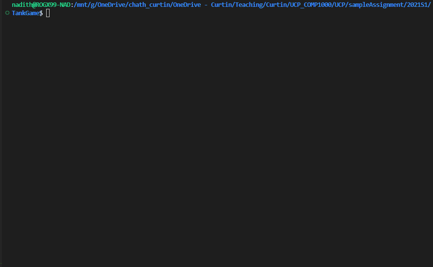

# 12 - C Samples

## How can I perform a simple animation in C?

Animation in C in linux follows the steps below

* clear the terminal
* print the frame
* sleep for awhile
* repeat the steps above in a while or for loop


```c
#define _DEFAULT_SOURCE /* Do not remove this. Required for time.h. Must be the on the top */
#include <time.h> /* Do not remove this. Required for newSleep */

#include <stdio.h>
#include <stdlib.h>
#include <string.h>

void newSleep(float sec)
{
	struct timespec ts;
	ts.tv_sec = (int) sec;
	ts.tv_nsec = (sec - ((int) sec)) * 1000000000;
	nanosleep(&ts,NULL);
}

void printArray(char* pMap, int iLen)
{
    int i;
    for (i = 0 ;  i < iLen ; i++)
    {
        printf("%c", pMap[i]);
    }
    printf("\n");
}

void progressBarAnimation(char* pMap, int iLen)
{    
    int i;

    /* Set the object on the array and animate*/    
    for (i = 0 /* start position */ ;  i < iLen ; i++)
    {
        system("clear");     /* Clear the terminal */
        pMap[i] = '>';       /* Set */  
        printArray(pMap, iLen);        
        newSleep(1);
        
    }

    /* Clear the whole array before exit */
    memset(pMap, ' ', sizeof(char) * iLen);
}

void movementAnimation(char* pMap, int iLen)
{
    int i;

    /* Set the object on the array and animate*/    
    for (i = 0 /* start position */ ;  i < iLen ; i++)
    {
        system("clear");     /* Clear the terminal */
        pMap[i] = '>';       /* Set */   
        printArray(pMap, iLen);        
        newSleep(1);
        pMap[i] = ' ';       /* Reset */        
    }

    system("clear"); /* Clear terminal before exit */
}

int main()
{
    int iLen = 10;   
    char* arrcMap = (char*) malloc(sizeof(int*) * iLen);
    memset(arrcMap, ' ', sizeof(char) * iLen); /* initialize to space char */    
    
    progressBarAnimation(arrcMap, iLen);
    movementAnimation(arrcMap, iLen);

    free(arrcMap);
    return 0;
}


```

## Is there any sample code for a past assignment?

Yes, there is. Please download the past Assignment Task 01, 2021, Semester 01 (specification) from Blackboard. Read it carefully and refer to the code below:

### <mark style="color:purple;">2021S1 - Task 01</mark>

**Read the highlights carefully:**

* Code comments (short & concise)
* Function header comments (short & concise)
* Modularization of the code (Short functions), 40-60 max lines of code.
* Line width (100 char max)
* Use of #define constants in macros.h (nothing is harded elsewhere)
* Use of function pointers
* Proper indentation of the code
* Low cyclomatic complexity of the code
* No multiple returns, global variables.
* No break, continue statements inside loops (switch statements are allowed).
* No code duplication.
* Header file usage (logical grouping of functions into headers).
* <mark style="color:red;">DO NOT include header files inside the header files unless it is absolutely needed.</mark>
* Static functions (all methods not listed in headers must be static).
* Meaningful variable names and function names (the name itself indicates what it does without comments).
* Input validation according to the assignment spec.
* 0 warnings, 0 errors during the compilation of the code.
* Valgrind (0 memory leaks, 0 errors) during gameplay & initial stage of validating input.
* Zero crashes (should meet all assignment spec requirements).
* Makefile dependencies are correctly listed (non-dependant headers not included).
* Performance improvement (Refer PERF comment) - Optional



### <mark style="color:purple;">2021S1 - Task 02</mark>

**Task 02 Highlights:**

* All Task 01 Highlights
* Object arrays (enemy, player, bullet) are now converted to structs
* Array indexing for object arrays is eliminated
* All game-related configs are read from a configuration file
* Linked list debug logs to detect all malloced memory has been freed
* File handling errors (file not exists, etc) are handled
* Valgrind (0 memory leaks, 0 errors) during gameplay & initial stage of validating input
* Zero crashes (should meet all assignment spec requirements)
* Makefile dependencies are correctly listed (non-dependant headers not included)


This code is developed in VSCode (Windows - WSL\[Ubuntu]). Please open it with VSCode if the indentation is not working on other editors. Windows style line endings may affect the indentation of the code.&#x20;



