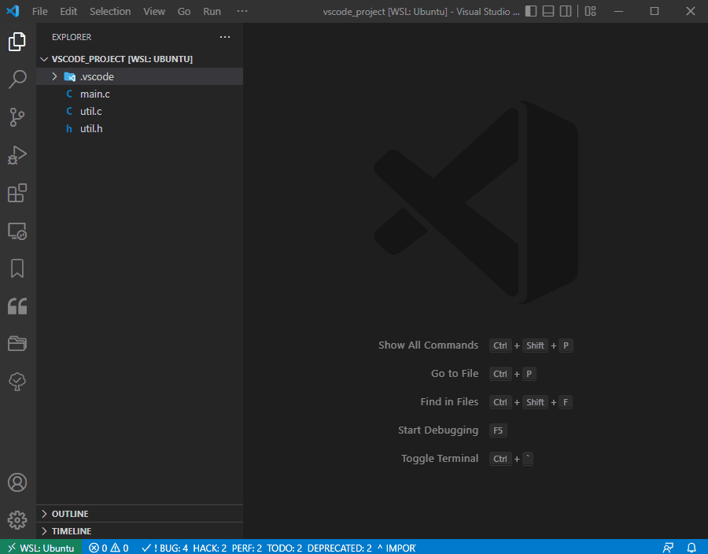
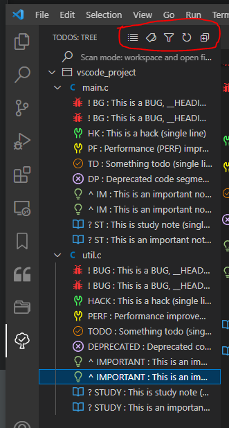

# Comments Tagging / Coloring

### 1. Install Todo Tree Extension (_by_ _Gruntfuggly)_

### 2. Install  Better Comments Extension (_by Aaron Bond_)

### 3. Configure VS Code as below:

* Create a `.vscode` folder in the root directory as shown in the video
* Create `settings.json` (this is going to be workspace settings) and place it inside `.vscode` folder
* Copy paste the following settings in your `settings.json` created above.

```json
{
  "todo-tree.general.statusBar": "tags",
  "todo-tree.general.tags": [
    "! BG",
    "! BUG",
    "HK",
    "HACK",
    "FX",
    "FIX",
    "PF",
    "PERF",
    "TD",
    "TODO",
    "DP",
    "DEPRECATED",
    "[ ]",
    "[x]",
    "^ IM",
    "^ IMPORTANT",
    "? ST",
    "? STUDY"
  ],

  "todo-tree.highlights.customHighlight": {
    "! BUG": {
      "icon": "bug",
      "iconColour": "#f83333",
      "foreground": "#f83333",
      "type": "line",  
      "gutterIcon": true,      
    },
    "HACK": {
      "icon": "tools",
      "iconColour": "#44ff5d",
      "foreground": "#44ff5d",
      "type": "line", 
      "gutterIcon": true
    },
    "FIX": {
      "icon": "flame",
      "iconColour": "yellow",
      "foreground": "yellow",
      "type": "line", 
      "gutterIcon": true
    },
    "PERF": {
      "icon": "tools",
      "iconColour": "#fffb00",
      "foreground": "#fffb00",
      "type": "line", 
      "gutterIcon": true
    },
    "TODO": {
      "foreground": "#FF8C00",
      "type": "line", 
      "iconColour": "#FF8C00",
      "rulerColour": "#FF8C00",
      "rulerLane": "center",
      "rulerOpacity": 100, // 0 - 255
      "gutterIcon": true
    },
    "DEPRECATED": {
      "icon": "x-circle",
      "iconColour": "#d6b1ff",
      "foreground": "#d6b1ff",
      "type": "line", 
      "gutterIcon": true
    },
    "^ IMPORTANT": {
      "icon": "light-bulb",
      "iconColour": "#98C379",
      "foreground": "#98C379",
      "type": "line", 
      "gutterIcon": true
    },
    "? STUDY": {
      "icon": "book",
      "foreground": "#3498DB",
      "iconColour": "#3498DB",
      "type": "line", 
      "gutterIcon": true
    }
  },
  "todo-tree.general.tagGroups": {
    "! BUG": ["! BG"],
    "HACK": ["HK"],
    "FIX": ["FX"],
    "PERF": ["PF"],
    "TODO": ["TD"],
    "DEPRECATED": ["DP"],
    "^ IMPORTANT": ["^ IM"],
    "? STUDY": ["? ST"]
  },
  "todo-tree.general.schemes": [
    "file",
    "ssh",
    "untitled",
    "vscode-notebook-cell",
    "vscode-userdata",
    "output"
  ],
  
  "better-comments.tags": [    
    {
        "tag": "!",
        "color": "#f83333",
        "strikethrough": false,
        "underline": false,
        "backgroundColor": "transparent",
        "bold": false,
        "italic": false
    },
    {
        "tag": "?",
        "color": "#3498DB",
        "strikethrough": false,
        "underline": false,
        "backgroundColor": "transparent",
        "bold": false,
        "italic": false
    },
    {
        "tag": "//",
        "color": "#474747",
        "strikethrough": true,
        "underline": false,
        "backgroundColor": "transparent",
        "bold": false,
        "italic": false
    },
    {
        "tag": "todo",
        "color": "#FF8C00",
        "strikethrough": false,
        "underline": false,
        "backgroundColor": "transparent",
        "bold": false,
        "italic": false
    },
    {
        "tag": "^",
        "color": "#98C379",
        "strikethrough": false,
        "underline": false,
        "backgroundColor": "transparent",
        "bold": false,
        "italic": false
    }
],
}
```

* Try the following source codes files in your VSCode, comment coloring will work like a charm :)



```c
#include <stdio.h>


/* Following are the short two-letter tags for comments colouring */

/* ! BG: This is a BUG, __HEADING LINE___ */

/* ! BG: This is a BUG, __HEADING LINE___
   ! The description continues to the next line (preceded with !)
   ! The description continues to the next line (preceded with !) */

/* HK: This is a hack (single line) */

/* PF: Performance (PERF) improvement fix (single line) */

/* TD: Something todo (single line) */

/* DP: Deprecated code segment (single line) */

/* ^ IM: This is an important note (single line) */

/* ^ IM: This is an important note, __HEADER__
   ^ The description continues to the next line (preceded with ^)
   ^ The description continues to the next line (preceded with ^) */

/* ? ST: This is a study note (single line) */

/* ? ST: This is an important note, __HEADER__
   ? The description continues to the next line (preceded with ?)
   ? The description continues to the next line (preceded with ?) */

int main()
{
    printf("Hello World\n");
    return 0;
}
```



```c
/* Following are the tags for comments colouring */

/* ! BUG: This is a BUG, __HEADING LINE___ */

/* ! BUG: This is a BUG, __HEADING LINE___
   ! The description continues to the next line (preceded with !)
   ! The description continues to the next line (preceded with !) */

/* HACK: This is a hack (single line) */

/* PERF: Performance improvement fix (single line) */

/* TODO: Something todo (single line) */

/* DEPRECATED: Deprecated code segment (single line)*/

/* ^ IMPORTANT: This is an important note (single line) */

/* ^ IMPORTANT: This is an important note, __HEADER__
   ^ The description continues to the next line (preceded with ^)
   ^ The description continues to the next line (preceded with ^) */

/* ? STUDY: This is a study note (single line) */

/* ? STUDY: This is an important note, __HEADER__
   ? The description continues to the next line (preceded with ?)
   ? The description continues to the next line (preceded with ?) */

int util_function()
{
        return 0;
}
```



**Video:**




Now you can filter comments by tag!

Notice the status bar of the VSCode GUI. It shows the stats about the number of BUG, HACK, TODO, etc.&#x20;


**Tryout the other options available in Todo Tree Plugin:**


