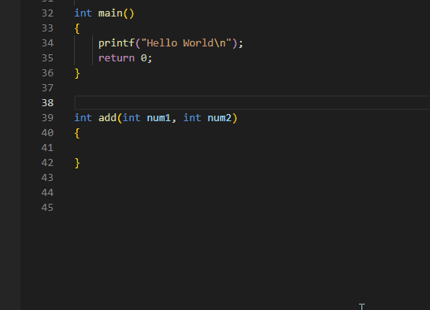

# Shortcuts/Tips

## 01. Function Header Comments (Doxygen)

* Place the cursor on top of the function
* Type `/**` and press `Enter`



## 02. Keyboard Shortcuts

### General Shortcuts

| Shortcut                                                                   | Description                                                                               |
| -------------------------------------------------------------------------- | ----------------------------------------------------------------------------------------- |
| <mark style="color:orange;">CTRL + S</mark>                                | Save                                                                                      |
| <mark style="color:orange;">CTRL + W</mark>                                | Close the current editor window                                                           |
| <mark style="color:orange;">CTRL + C</mark>                                | Copy                                                                                      |
| <mark style="color:orange;">CTRL + V</mark>                                | Paste                                                                                     |
| <mark style="color:orange;">CTRL + X</mark>                                | Cut                                                                                       |
| <mark style="color:orange;">CTRL + Z</mark>                                | Undo                                                                                      |
| <mark style="color:orange;">CTRL + (left / right)</mark> arrow key         | Move the cursor word by word                                                              |
| <mark style="color:orange;">SHIFT + CTRL + (left / right)</mark> arrow key | Select word by word                                                                       |
| <mark style="color:orange;">SHIFT + (down/up)</mark> arrow key             | Select a line                                                                             |
| <mark style="color:orange;">CTRL + (down/up)</mark> arrow key              | Scroll down / up the editor                                                               |
| <mark style="color:orange;">CTRL + \~</mark>                               | Swtich to terminal                                                                        |
| <mark style="color:orange;">CTRL + 1 / 2 / 3 ...</mark>                    | Switch the editor (if you have multiple editor windows side by side, use the right index) |
| <mark style="color:orange;">CTRL + SHIFT + e</mark>                        | Focus on File Explorer; you can use arrow keys to select the files thereafter.            |
| <mark style="color:orange;">CTRL + ALT + (left / right)</mark> arrow key   | Move the file to a new editor window                                                      |
| <mark style="color:orange;">CTRL + H</mark>                                | Find and Replace                                                                          |
| <mark style="color:orange;">ALT + mouse click to place cusor</mark>        | To place multiple cursors at mouse click                                                  |

### Moving lines up and down

Place the cursor at the beginning of the line, press <mark style="color:orange;">**ALT + (up/down)**</mark> arrow  to move the line&#x20;

### Turn on Autosave

VSCode requires you to save your work manually every time before compiling your code. To turn on Autosave, goto <mark style="color:orange;">**File -> Auto Save**</mark>

## 03. Settings File (`settings.json`)

Open VSCode settings by `` CTRL + ` ``&#x20;

Click on (Open Settings.json) - Top Right corner Icon

### Add Rulers to the Editor&#x20;

add the following to the `settings.json`&#x20;

```json
"editor.rulers": [
    //100,
    {"column": 80, "color": "#00ff0027"},
    {"column": 100, "color": "#ffffff27"},
    {"column": 120, "color": "#ff000045"}
],
```


